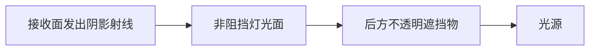

# Sparkium：稳定实体顺序与非阻挡灯光阴影修复

本 PR 修复两个独立问题：相同场景的灯光采样随实体地址变化，以及完整 RT 在非阻挡灯光后漏检遮挡物。前者影响可重复性，后者造成错误漏光。它们是在 PR #38 的 Windows 验证中发现、当时尚未提交的修复，现在作为独立修复提交。

基于合并 PR #38 后的 `main`（`40acd7cde2d6f2210775875df39e944d5e493c99`），修复提交为 `d152bc0`。增量仅含 7 个框架文件与 1 个 GPU 测试文件，不重复包含 Blender 功能开发。场景 assets 仍为 `07f7bd6670d836afe93e0a0f26caec913a19bca6`。

## 1. 实体地址改变灯光采样顺序

**触发条件。** 场景和后端实体缓存以 `std::map<Entity*, ...>` 保存实体。原实现按 map 的指针顺序遍历；同样的场景在不同进程或后端中分配到不同地址时，灯光注册顺序也会改变。固定样本索引产生的随机数因此映射到不同灯光，最终像素不同。

例如红、蓝两盏灯的功率权重不同，CDF 按“红→蓝”和“蓝→红”排列时，同一个随机数可能选中不同灯光。这是可重复性缺陷；仅凭这种排序差异，不能断定 Monte Carlo 估计存在系统性偏差。

**修复机制。** Scene 新增注册顺序数组与只读 `GetEntityOrder()`。首次成功插入才追加，重复添加不重复注册，删除同步移除；停用／启用不改变位置。RT 与 raster 后端按前端注册顺序更新活动实体，原 map 继续负责状态查询、缓存与移除。这也稳定了实例和灯光的注册顺序。raster 的改动仅是消费同一顺序接口，不涉及材质图崩溃修复。

**回归测试。** `LightSamplingIsIndependentOfEntityAddresses` 构造两组等价红／蓝灯光，故意让后端地址排列相反，按相同语义顺序注册；包含重复添加及停用／启用操作。对 RT、Ray Query、Fallback 和基础 raster 输出逐像素比较，容差 `1e-6`，并要求图像实际受光，避免两张黑图误通过。


图中每一行比较自身相同输入、相同采样设置的两次独立启动。右列为线性 RGB 绝对差的最大通道 ×10 后截断到显示范围，黑色表示无差异。修复前为 96×96、256 spp、12 bounces；修复后为 64×64、256 spp、16 bounces。两行设置不同，不用于比较图像质量或性能；这里只展示各自重复运行是否一致。

| 历史重复性检查 | 修复前 | 修复后 |
|---|---|---|
| Vulkan Ray Query 两次启动 | 最大 RGB 绝对差 0.561422；归一化 RGB RMSE 8.168% | RGBA 逐位一致，最大差 0 |
| D3D12/Vulkan × 三种追踪管线 | 未对全部组合记录修复前重复性结论 | 六路重复启动均逐位一致；每路 256 spp 单次提交与 16×16 spp 分批提交也逐位一致，共 12 个对照 |

## 2. 非阻挡灯光导致完整 RT 漏检后方遮挡物

**触发条件。** 阴影射线依次经过 `block_ray=false` 的灯光面、一个不透明遮挡物，再到光源。原灯光 shadow closest-hit 遇到非阻挡灯光时保留可见度，却没有恢复遍历以寻找后方遮挡物。于是完整 RT 认为光源可见，接收面错误受光；Ray Query/Fallback 的对应最小复现为黑色。



修复前在 B 返回可见，漏掉 C。修复后在 B 的 any-hit 中 `IgnoreHit()`，继续遍历，并在 C 确认遮挡。

**修复机制。** 灯光 sampler 声明 `SAMPLE_SHADOW_ANY_HIT`，提供 `SampleShadowOpacity`：非阻挡灯光返回 0，阻挡灯光返回 1。RT core 编译并缓存 `mesh_light_shadow_ahit`，实体层绑定到灯光的 shadow hit group。已有通用 any-hit 根据 opacity 继续遍历或接受遮挡；最终进入灯光 shadow closest-hit 时将可见度归零。计算追踪路径复用同一 opacity 接口。

**回归测试。** `NonblockingEmittersDoNotHideShadowOccluders` 使用零发光量的非阻挡灯光面隔离遍历行为，开启 `alpha_shadow`、32×32、16 spp、1 bounce，并在三种追踪管线下检查：

| 控制场景 | 期望输出 |
|---|---|
| 非阻挡灯光 + 后方不透明遮挡物 | 黑色，每个 RGB 分量在 `1e-6` 内为零 |
| 非阻挡灯光 + 关闭后方遮挡物 | 接收面受光，RGB 总和大于 1 |
| 灯光改为阻挡 + 关闭后方遮挡物 | 灯光自身遮挡，输出黑色 |

所有像素同时检查有限性。两个控制场景可防止“永远返回黑色”或“永远忽略灯光”这种错误修复通过测试。


以上均为历史实测输出的最近邻放大，没有重绘像素。最小复现在 D3D12、Vulkan 上修复前完整 RT 的平均线性 RGB 约为 0.07009，Query/Fallback 为 0；修复后六路均为 0。


Monster 历史验证为 48×48、1024 spp。D3D12 RT/Query 最大通道均值相对偏差由 1.698% 降至 0.025%；修复后 Vulkan 对应偏差为 0.078%。这是有限样本的管线对照，不是任意场景完全收敛、性能提升或 Blender Cycles 等价的保证。

## 本次提交验证与复现

本次基于新分支增量构建 `sparkium_fallback_test` Release 成功，并重新运行完整 GPU 测试套件：

| 后端 | 结果 | API debug |
|---|---|---|
| D3D12 | 16/16 通过，无跳过 | 开启 |
| Vulkan | 16/16 通过，无跳过 | 开启 |

环境：Windows、RTX 3090 Ti、NVIDIA 596.49、MSVC 19.44、Vulkan SDK 1.4.321.0。构建延用 `CL=/D_USE_MATH_DEFINES`，以适配现有 hair 代码的 `M_PI`；构建仍有既有 MSB8028 中间目录警告。没有重新运行整套大场景矩阵。

```powershell
$env:CL = '/D_USE_MATH_DEFINES'
cmake --build build --config Release --target sparkium_fallback_test --parallel 8
$env:SPARKIUM_TEST_DEBUG = '1'
$env:SPARKIUM_TEST_BACKEND = 'd3d12'
& ./build/test/sparkium/Release/sparkium_fallback_test.exe
$env:SPARKIUM_TEST_BACKEND = 'vulkan'
& ./build/test/sparkium/Release/sparkium_fallback_test.exe
```

仅复现两项回归时增加参数 `--gtest_filter=SoftwareBVHTest.LightSamplingIsIndependentOfEntityAddresses:SoftwareBVHTest.NonblockingEmittersDoNotHideShadowOccluders`。新测试纳入原有测试目标；后端环境变量保留未设置时的默认选择。

本报告图片及重复性数值来自 PR #38 验证时保存的数据；本次新跑的是上表 GPU 套件。已逐文件核对，本次提交的全部 8 个源码／测试文件与历史验证 manifest 的 SHA-256 一致，见 [本次版本与哈希](manifest.json)。旧报告中“未提交”的描述记录的是当时状态，这个新 PR 正式提交了两项修复。

证据：[D3D12 新测试](gpu-d3d12.json)、[Vulkan 新测试](gpu-vulkan.json)、[图片数值](ordering-comparison.json)、[历史修复前重复性](historical-repeat-before.json)、[历史修复后重复性](historical-repeat-after.json)。[原始完整图文报告及矩阵证据](https://github.com/LazyJazzDev/LongMarchAssetsLFS/blob/0cd57220dc3375c245eb1818157880196d611778/reports/blender-align-validation-20260917/README.md)。

## 范围与保留问题

Classroom / D3D12 / Fallback 在旧矩阵中退出 2170，以及 graph_smoke / 两后端 raster 退出 3221225477，继续按用户要求暂缓。本 PR 不声称修复这些崩溃。测试覆盖中的基础 Fallback／raster 对照不等于重新启动这两项排查。Metal 与其他 GPU 未在本次运行验证。

CLI 浮点 checkpoint、通用渲染矩阵脚本和其他本地文件不属于这次源码提交。图像通过 LongMarchAssetsLFS 发布在独立报告目录，不改变渲染场景 assets 子模块指针。
